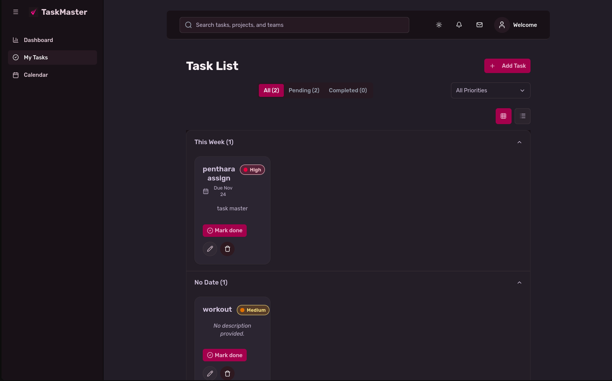

# TaskMaster - Modern Task Management Application

A sophisticated, feature-rich task management application built with React, TypeScript, and Vite. TaskMaster provides an intuitive interface for organizing, tracking, and managing tasks with beautiful UI components, real-time analytics, and seamless user experience.



## Table of Contents

- [Overview](#overview)
- [Features](#features)
- [Technology Stack](#technology-stack)
- [Project Structure](#project-structure)
- [Getting Started](#getting-started)
- [Key Components](#key-components)
- [UI Components](#ui-components)
- [Data Management](#data-management)
- [Styling & Theming](#styling--theming)
- [Responsive Design](#responsive-design)
- [Development](#development)
- [Build & Deployment](#build--deployment)

## Overview

TaskMaster is a modern, single-page application designed to help users efficiently manage their daily tasks. The application features a clean, intuitive interface with powerful functionality including task creation, editing, filtering, calendar integration, and comprehensive analytics dashboards.

### Key Highlights

- **Zero Backend Required**: All data is stored locally using browser localStorage
- **Fully Responsive**: Seamlessly works on desktop, tablet, and mobile devices
- **Dark Mode Support**: Beautiful light and dark themes with system preference detection
- **Real-time Analytics**: Interactive charts and progress tracking
- **Smooth Animations**: Polished UI with smooth transitions and micro-interactions
- **Type-Safe**: Built with TypeScript for enhanced developer experience and reliability

## Features

### Core Functionality

- **Task Management**
  - Create, read, update, and delete tasks
  - Set task priorities (Low, Medium, High)
  - Add due dates and descriptions
  - Mark tasks as completed
  - Search and filter tasks by status and priority

- **Dashboard Analytics**
  - Real-time statistics (Total, Completed, Pending, High Priority tasks)
  - Animated progress bars showing completion percentage
  - Interactive charts (Bar charts, Area charts)
  - 7-day completion trend analysis
  - Upcoming tasks notification system

- **Calendar View**
  - Visual calendar with task indicators
  - Click dates to view tasks for specific days
  - Upcoming tasks sidebar
  - Task grouping by date ranges

- **Task Organization**
  - Accordion-based grouping (Today, This Week, This Month, Later, No Date)
  - Grid and List view modes
  - Priority-based filtering
  - Status-based filtering (All, Pending, Completed)

### User Experience

- **Search Functionality**: Global search across all tasks
- **Theme Toggle**: Switch between light and dark modes
- **Responsive Sidebar**: Collapsible navigation sidebar
- **Mobile Optimized**: Touch-friendly interface for mobile devices
- **Smooth Animations**: Number flow animations, progress bars, and transitions

## Technology Stack

### Core Technologies

- **React 19.2.0** - Modern UI library with latest features
- **TypeScript 5.9.3** - Type-safe JavaScript
- **Vite 7.2.2** - Next-generation frontend build tool
- **Tailwind CSS 4.1.17** - Utility-first CSS framework

### UI Libraries & Components

- **Radix UI** - Accessible component primitives
- **Lucide React** - Beautiful icon library
- **Recharts 2.15.4** - Composable charting library
- **Motion 12.23.24** - Animation library
- **Class Variance Authority** - Component variant management

### Development Tools

- **ESLint** - Code linting and quality assurance
- **TypeScript ESLint** - TypeScript-specific linting rules
- **Vite Plugin React** - Fast Refresh and HMR support

## Project Structure

```
PentharaAssignment/
├── src/
│   ├── components/          # React components
│   │   ├── Header.tsx       # Top navigation bar
│   │   ├── Sidebar.tsx      # Left navigation sidebar
│   │   ├── TaskForm.tsx     # Task creation/edit form
│   │   ├── TaskItem.tsx     # Individual task card
│   │   ├── TaskList.tsx     # Task list container
│   │   └── ui/              # Reusable UI components
│   │       ├── accordion.tsx
│   │       ├── animated-input.tsx
│   │       ├── animated-progress-bar.tsx
│   │       ├── badge.tsx
│   │       ├── button.tsx
│   │       ├── card.tsx
│   │       ├── chart.tsx
│   │       ├── clipped-area-chart.tsx
│   │       ├── dialog.tsx
│   │       ├── dropdown.tsx
│   │       ├── dynamic-island.tsx
│   │       ├── input.tsx
│   │       ├── monochrome-bar-chart.tsx
│   │       ├── number-flow.tsx
│   │       ├── separator.tsx
│   │       ├── tabs.tsx
│   │       └── textarea.tsx
│   ├── pages/               # Page components
│   │   ├── DashboardPage.tsx    # Analytics dashboard
│   │   ├── TasksPage.tsx        # Main tasks page
│   │   └── CalendarPage.tsx     # Calendar view
│   ├── services/            # Business logic
│   │   └── taskService.ts   # Task CRUD operations
│   ├── lib/                 # Utility functions
│   │   ├── utils.ts         # Helper functions
│   │   └── get-strict-context.tsx
│   ├── hooks/               # Custom React hooks
│   │   └── use-controlled-state.tsx
│   ├── App.tsx              # Root component
│   ├── main.tsx             # Application entry point
│   ├── index.css            # Global styles
│   └── App.css              # Component styles
├── public/                  # Static assets
│   ├── taskmaster.svg
│   ├── tick.svg
│   └── vite.svg
├── screenshots/             # Application screenshots
├── package.json             # Dependencies and scripts
├── vite.config.ts           # Vite configuration
├── tsconfig.json            # TypeScript configuration
├── tailwind.config.js       # Tailwind CSS configuration
└── README.md                # This file
```

## Getting Started

### Prerequisites

- **Node.js** 18.x or higher
- **npm** or **yarn** package manager

### Installation

1. **Clone the repository**
   ```bash
   git clone https://github.com/rupak1005/Assignment-Penthara.git
   cd Assignment-Penthara
   ```

2. **Install dependencies**
   ```bash
   npm install
   ```

3. **Start the development server**
   ```bash
   npm run dev
   ```

4. **Open your browser**
   Navigate to `http://localhost:5173` (or the port shown in your terminal)

### Available Scripts

- `npm run dev` - Start development server with hot module replacement
- `npm run build` - Build the application for production
- `npm run preview` - Preview the production build locally
- `npm run lint` - Run ESLint to check code quality

## Key Components

### App Component (`src/App.tsx`)

The root component that manages:
- Global application state (theme, sidebar, current view)
- Route/page rendering
- Theme persistence in localStorage
- Responsive sidebar behavior
- Mobile device detection

**Key Features:**
- Theme management with system preference detection
- Responsive sidebar that auto-collapses on mobile
- Global search functionality
- Smooth page transitions

### Dashboard Page (`src/pages/DashboardPage.tsx`)

Comprehensive analytics dashboard featuring:

- **Statistics Cards**: Total tasks, completed tasks, pending tasks, high priority tasks
- **Progress Tracking**: Animated progress bar showing completion percentage
- **Data Visualization**:
  - Task status overview (bar chart)
  - 7-day completion trend (area chart)
- **Dynamic Notifications**: Floating notification island for upcoming tasks
- **Real-time Updates**: All metrics update automatically as tasks change

### Tasks Page (`src/pages/TasksPage.tsx`)

Main task management interface with:

- **Task Filtering**: Filter by status (All, Pending, Completed) and priority
- **Search Integration**: Real-time search across task titles and descriptions
- **Task CRUD Operations**: Create, edit, delete, and toggle completion
- **View Modes**: Switch between grid and list layouts
- **Accordion Grouping**: Tasks organized by date ranges
- **Modal Dialogs**: Smooth task creation and editing experience

### Calendar Page (`src/pages/CalendarPage.tsx`)

Interactive calendar view providing:

- **Monthly Calendar Grid**: Full month view with task indicators
- **Date Selection**: Click any date to view associated tasks
- **Task Indicators**: Visual dots showing tasks per day
- **Upcoming Tasks Sidebar**: List of tasks due in the next 7 days
- **Navigation**: Previous/next month navigation
- **Today Highlight**: Current date clearly marked

### Task Service (`src/services/taskService.ts`)

Centralized data management layer:

- **localStorage Integration**: Persistent data storage
- **CRUD Operations**: Complete task lifecycle management
- **Type Safety**: Full TypeScript interfaces
- **Error Handling**: Graceful error handling with fallbacks

**Task Interface:**
```typescript
interface Task {
  id: string;
  title: string;
  description?: string;
  dueDate?: string;
  priority: 'low' | 'medium' | 'high';
  completed: boolean;
  createdAt: string;
}
```

## UI Components

### Custom UI Components

The application includes a comprehensive set of custom UI components built with Radix UI primitives and Tailwind CSS:

#### Form Components
- **AnimatedInput**: Input fields with floating labels and smooth animations
- **Dropdown**: Custom dropdown with keyboard navigation
- **Textarea**: Multi-line text input with consistent styling

#### Display Components
- **Card**: Container component with glassmorphism effects
- **Badge**: Priority and status indicators
- **Button**: Multiple variants (default, outline, ghost, destructive)
- **Tabs**: Tab navigation for filtering

#### Data Visualization
- **AnimatedProgressBar**: Smooth animated progress indicators
- **NumberFlow**: Animated number counters
- **MonochromeBarChart**: Clean bar chart visualization
- **ClippedAreaChart**: Area chart with trend indicators

#### Interactive Components
- **Accordion**: Collapsible sections for task grouping
- **Dialog**: Modal dialogs for forms and confirmations
- **DynamicIsland**: Floating notification component

### Design System

- **Color Palette**: Consistent color scheme with dark mode variants
- **Typography**: Clear hierarchy with responsive font sizes
- **Spacing**: Consistent spacing scale using Tailwind utilities
- **Shadows & Effects**: Subtle shadows and backdrop blur effects
- **Animations**: Smooth transitions and micro-interactions

## Data Management

### Storage Strategy

TaskMaster uses **localStorage** for data persistence, providing:

- **Zero Configuration**: No backend setup required
- **Instant Persistence**: Data saved immediately on changes
- **Browser-Based**: Data stored locally in user's browser
- **Automatic Sync**: All components stay in sync automatically

### Data Flow

1. **User Action** → Component event handler
2. **Service Call** → `taskService.ts` method
3. **State Update** → React state management
4. **localStorage** → Persistent storage
5. **UI Update** → Automatic re-render

### Data Structure

Tasks are stored as a JSON array in localStorage under the key `task_tracker_tasks`. Each task includes:
- Unique ID (timestamp-based)
- Title (required)
- Description (optional)
- Due date (optional, ISO format)
- Priority level
- Completion status
- Creation timestamp

## Styling & Theming

### Tailwind CSS Configuration

The application uses Tailwind CSS 4.x with:
- Custom color palette for light/dark modes
- Extended spacing and typography scales
- Custom animations and transitions
- Responsive breakpoints

### Dark Mode

- **System Detection**: Automatically detects user's system preference
- **Manual Toggle**: Theme switcher in header
- **Persistent**: Theme preference saved in localStorage
- **Smooth Transitions**: Seamless theme switching

### CSS Variables

The application uses CSS custom properties for theming:
- `--background`: Main background color
- `--foreground`: Primary text color
- `--card`: Card background
- `--primary`: Primary accent color
- `--secondary`: Secondary accent color
- `--muted`: Muted text and backgrounds
- `--accent`: Accent colors
- `--destructive`: Error/destructive actions

## Responsive Design

### Breakpoints

- **Mobile**: < 768px (sm)
- **Tablet**: 768px - 1024px (md, lg)
- **Desktop**: > 1024px (xl, 2xl)

### Mobile Optimizations

- **Collapsible Sidebar**: Auto-collapses on mobile with overlay
- **Touch-Friendly**: Larger touch targets for buttons
- **Responsive Grids**: Task cards adapt to screen size
- **Mobile Navigation**: Hamburger menu for sidebar toggle
- **Optimized Forms**: Full-width inputs on mobile

### Responsive Features

- **Flexible Layouts**: Grid systems adapt to available space
- **Conditional Rendering**: Some features hidden on small screens
- **Optimized Images**: Responsive image handling
- **Viewport Meta**: Proper mobile viewport configuration

## Development

### Code Quality

- **TypeScript**: Full type coverage for reliability
- **ESLint**: Code linting with React and TypeScript rules
- **Component Documentation**: JSDoc comments for all components
- **Consistent Naming**: Clear, descriptive component and variable names

### Best Practices

- **Component Composition**: Reusable, composable components
- **Separation of Concerns**: Clear separation between UI, logic, and data
- **Performance Optimization**: React.memo, useMemo, useCallback where appropriate
- **Accessibility**: ARIA labels and keyboard navigation support

### File Organization

- **Feature-Based**: Components grouped by feature
- **Shared Components**: Reusable UI components in `/ui` folder
- **Service Layer**: Business logic separated from UI
- **Type Definitions**: TypeScript interfaces in service files

## Build & Deployment

### Production Build

```bash
npm run build
```

This command:
- Type-checks the codebase
- Optimizes and minifies assets
- Generates production-ready files in `dist/` directory
- Creates source maps for debugging

### Build Output

The build process generates:
- **HTML**: Optimized index.html
- **JavaScript**: Bundled and minified JS files
- **CSS**: Extracted and optimized CSS
- **Assets**: Optimized images and static files

### Deployment Options

The application can be deployed to:
- **Vercel**: Zero-config deployment
- **Netlify**: Drag-and-drop or Git integration
- **GitHub Pages**: Static site hosting
- **Any Static Host**: Works with any static file server

### Environment Variables

Currently, no environment variables are required. All configuration is handled through:
- Vite configuration (`vite.config.ts`)
- Tailwind configuration
- TypeScript configuration

## Screenshots

The project includes screenshots in the `/screenshots` directory:
- 
- 
- 
- 

## Contributing

This is a project assignment. For contributions:

1. Follow the existing code style
2. Maintain TypeScript type safety
3. Add appropriate comments and documentation
4. Test responsive behavior
5. Ensure dark mode compatibility

## License

This project is created as part of an assignment.

## Acknowledgments

- **Radix UI** for accessible component primitives
- **Tailwind CSS** for the utility-first CSS framework
- **Recharts** for beautiful chart components
- **Lucide** for the comprehensive icon library
- **Vite** for the lightning-fast build tool

---

